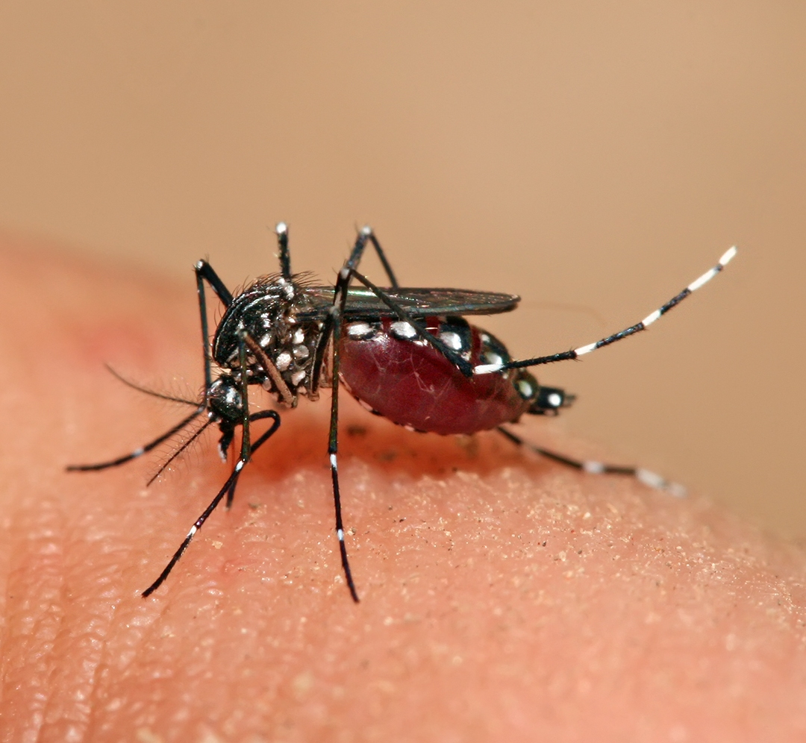

```{r}
#| label: load-packages
#| message: false
#| warning: false

library(tidyverse)
library(lubridate)
library(plotly)
library(tsibble)
library(feasts)
library(fabletools)
library(DT)
library(dygraphs)
library(xts)
library(leaflet)
library(denguedatahub)
library(sf)
library(ceylon)
library(rmapshaper)
```

```{r}
#| label: load-data
#| message: false
#| warning: false

data(srilanka_weekly_data)
data(sl_dengue_serotype)
```

```{r}
#| label: clean-data
#| message: false
#| warning: false

sl <- srilanka_weekly_data |>
  mutate(start.date = parse_date_time(start.date, orders = c("mdy", "ymd"))) |>
  mutate(start.date = as.Date(start.date)) |>
  mutate(epi_week = paste0(year(start.date), " - Week ", sprintf("%02d", isoweek(start.date)))) |>
  arrange(district, start.date)

# Merge Kalmune into Ampara at the source, once, so every downstream
# table (top10, District Explorer, the map) is counting the same districts
sl <- sl |>
  mutate(district = if_else(district == "Kalmune", "Ampara", district))

sl_total <- sl |>
  group_by(start.date) |>
  summarise(
    cases    = sum(cases, na.rm = TRUE),
    epi_week = first(epi_week),
    .groups  = "drop"
  )

annual_district <- sl |>
  mutate(year = year(start.date)) |>
  group_by(district, year) |>
  summarise(annual_cases = sum(cases, na.rm = TRUE), .groups = "drop")

top10 <- annual_district |>
  group_by(district) |>
  summarise(total = sum(annual_cases), .groups = "drop") |>
  slice_max(total, n = 10, with_ties = FALSE) |>
  pull(district)


# --- DATA FOR CHOROPLETH MAP (Polygons) ---

data("district", package = "ceylon")

# Standardize the ceylon shapefile names AND transform to Leaflet's CRS (4326)
sl_sf <- district |>
  st_transform(4326) |>
  rename_with(tolower) |>
  rename(shapename = district) |>
  mutate(
    shapename_disp = str_to_title(shapename), 
    join_name = str_to_lower(str_replace_all(shapename, "[^a-zA-Z]", "")),
    join_name = case_when(
      join_name == "mullaittivu" ~ "mullaitivu",
      join_name == "hambanthota" ~ "hambantota",
      join_name == "moneragala"  ~ "monaragala",
      TRUE ~ join_name
    )
  )

# Simplify polygon geometry so it isn't duplicated at full resolution
# once per year in the leaflet widget (this is what was inflating the file to 376MB)
sl_sf <- sl_sf |>
  ms_simplify(keep = 0.05, keep_shapes = TRUE)

# Standardize the dengue data names exactly the same way
# (Kalmune is already merged into Ampara upstream, so no fixup needed here)
map_data_clean <- annual_district |>
  mutate(
    join_name = str_to_lower(str_replace_all(district, "[^a-zA-Z]", "")),
    join_name = case_when(
      join_name == "mullaittivu" ~ "mullaitivu",
      join_name == "hambanthota" ~ "hambantota",
      join_name == "moneragala"  ~ "monaragala",
      TRUE ~ join_name
    )
  ) |>
  group_by(join_name, year) |>
  summarise(annual_cases = sum(annual_cases, na.rm = TRUE), .groups = "drop")

# Create the grid so every district has a row for every year
grid <- expand_grid(
  join_name = na.omit(unique(sl_sf$join_name)),
  year      = na.omit(unique(map_data_clean$year))
)

# Join the tables properly by BOTH name and year so the map data aligns
map_data_full <- grid |>
  left_join(map_data_clean, by = c("join_name", "year")) |>
  mutate(annual_cases = replace_na(annual_cases, 0))

# Join the full data back to the spatial polygons
yearly_map_data_sf <- sl_sf |>
  left_join(map_data_full, by = "join_name") |>
  filter(!is.na(year))

districts <- sort(unique(sl$district))

sl_ts <- sl_total |>
  mutate(year_week = yearweek(start.date)) |>
  as_tsibble(index = year_week) |>
  fill_gaps(cases = 0)
```

# Overview

## Row {height="30%"}

```{r}
#| content: valuebox
#| title: "Total Reported Cases"
list(
  icon  = "virus",
  color = "danger",
  value = format(sum(sl_total$cases, na.rm = TRUE), big.mark = ",")
)
```

```{r}
#| content: valuebox
#| title: "Highest Weekly Case Count"
peak <- sl_total |> slice_max(cases, n = 1, with_ties = FALSE)
list(
  icon  = "arrow-up-circle",
  color = "warning",
  value = format(peak$cases, big.mark = ",")
)
```

```{r}
#| content: valuebox
#| title: "Week with Highest Cases"
list(
  icon  = "calendar-week",
  color = "info",
  value = peak$epi_week
)
```

```{r}
#| content: valuebox

serotype_count <- sl_dengue_serotype |>
  separate_rows(dengue.serotype, sep = ",\\s*") |>
  distinct(dengue.serotype) |>
  nrow()

list(
  title = "Serotypes Identified (As of 2017 including genetic variations)",
  icon  = "virus2",
  color = "secondary",
  value = serotype_count
)
```

## Row {height="70%"}

### Column {width="62%"}

::: {.card title="About This Dashboard"}

Dengue is a mosquito-borne viral disease transmitted primarily by *Aedes aegypti* mosquitoes and remains a major public health concern in Sri Lanka. This dashboard explores Sri Lanka's weekly dengue surveillance data from the `denguedatahub` R package, developed by Dr. Thiyanga Talagala and collaborators.

**This Dashboard Consists**

- **National Trends** displays long-term dengue trends and compares annual case counts across high-incidence districts.
- **Trend & Seasonality** presents an STL decomposition of dengue incidence into trend, seasonal, and irregular components.
- **District Explorer** allows users to explore weekly dengue trends for individual districts using an interactive selector and time range slider, and a heatmap of district-level case patterns over time.
- **Spatial Distribution** visualizes the geographic distribution of annual dengue cases. 
- **Serotypes** presents the historical circulation of dengue virus serotypes reported in Sri Lanka.
- **Data** provides the surveillance and serotype datasets used throughout the dashboard.

:::

### Column {width="38%"}

::: {.card title="Aedes aegypti" expandable=false}

<div style="display:flex; align-items:center; justify-content:center; height:80%; background:#eef2f7; border-radius:8px;">
  
</div>

<p style="text-align:center; font-size:0.85rem; color:var(--dhd-muted); margin-top:8px;">
Primary vector for dengue transmission.
</p>

:::

# National Trends

## Row

### Column {width="50%"}

```{r}
#| title: "National Weekly Reported Cases"
p_nat <- plot_ly(sl_total, x = ~start.date, y = ~cases, type = 'scatter', mode = 'lines',
                 line = list(color = "#2f6dd5", width = 1.5),
                 fill = 'tozeroy', fillcolor = 'rgba(47, 109, 213, 0.12)',
                 text = ~paste("<b>National Total</b><br>", epi_week, "<br>Cases: ", format(cases, big.mark = ",")),
                 hoverinfo = "text") |>
  layout(
    xaxis = list(title = "Timeline (Epi Weeks)", tickformat = "%Y - Week %V"),
    yaxis = list(title = "Weekly Cases"),
    hovermode = "x unified"
  )

p_nat
```

### Column {width="50%"}

```{r}
#| title: "Annual Reported Cases of the top 10 Highest-Burden Districts"
#| message: false
#| warning: false

n_dist <- length(top10)
base_pal <- c("#185FA5", "#378ADD", "#0F6E56", "#1D9E75", "#534AB7", 
              "#7F77DD", "#5F5E5A", "#888780", "#993C1D", "#D85A30")
pal <- if (n_dist <= length(base_pal)) base_pal[seq_len(n_dist)] else colorRampPalette(base_pal)(n_dist)

p_top10 <- annual_district |>
  filter(district %in% top10) |>
  mutate(district = factor(district, levels = top10)) |>
  plot_ly(
    x = ~year, 
    y = ~annual_cases, 
    color = ~district, 
    colors = pal,
    type = "scatter", 
    mode = "lines+markers",
    line = list(width = 2),
    marker = list(size = 6),
    text = ~paste0("<b>", district, "</b><br>Year: ", year, "<br>Cases: ", format(annual_cases, big.mark = ",")),
    hoverinfo = "text"
  ) |>
  layout(
    xaxis = list(title = "Reporting Year"),
    yaxis = list(title = "Annual Cases", tickformat = ","),
    legend = list(orientation = "h", x = 0, y = -0.3, font = list(size = 9)),
    hovermode = "closest",
    margin = list(b = 100)
  ) |>
  htmlwidgets::onRender("
    function(el, x) {
      var clickTimer = null;
      var clickDelay = 300;

      el.on('plotly_legendclick', function(data) {
        var curveNumber = data.curveNumber;

        if (clickTimer) {
          clearTimeout(clickTimer);
          clickTimer = null;

          var alreadyIsolated = el.data.every(function(trace, i) {
            return i === curveNumber
              ? trace.visible === undefined || trace.visible === true
              : trace.visible === 'legendonly';
          });

          var newVisibility = el.data.map(function(trace, i) {
            return alreadyIsolated ? true : (i === curveNumber ? true : 'legendonly');
          });

          Plotly.restyle(el, {visible: newVisibility});
        } else {
          clickTimer = setTimeout(function() {
            clickTimer = null;
            var trace = el.data[curveNumber];
            var isVisible = trace.visible === undefined || trace.visible === true;
            Plotly.restyle(el, {visible: isVisible ? 'legendonly' : true}, [curveNumber]);
          }, clickDelay);
        }

        return false;
      });
    }
  ")

htmltools::browsable(
  htmltools::tagList(
    p_top10,
    htmltools::tags$p(
      "💡 Click a district name in the legend to show/hide it & double-click to isolate it, double-click again to reset.",
      style = "text-align:center; font-size:0.7rem; color:var(--dhd-muted); margin-top:2px; margin-bottom:0;"
    )
  )
)
```


# Trend & Seasonality

## Row {height="10%"}

STL (Seasonal-Trend decomposition using Loess) separates the observed dengue case series into three components: a long-term trend, recurring seasonal patterns, and an irregular remainder. This helps identify underlying transmission patterns that may not be immediately visible in the raw data.

## Row {height="90%"}

```{r}
#| title: "STL Decomposition of the National Reported Weekly Cases"
#| message: false
#| warning: false

dcmp <- sl_ts |>
  model(STL(cases ~ season(period = 52), robust = TRUE)) |>
  components()

p_dcmp_data <- dcmp |>
  as_tibble() |>
  mutate(
    plot_date = as.Date(year_week),
    epi_week  = paste0(year(plot_date), " - Week ", sprintf("%02d", isoweek(plot_date)))
  ) |>
  pivot_longer(
    cols      = c(cases, trend, season_52, remainder), 
    names_to  = "component",
    values_to = "value"
  ) |>
  mutate(component = factor(
    component,
    levels = c("cases", "trend", "season_52", "remainder"), 
    labels = c("Observed", "Trend", "Seasonal", "Remainder")
  ))

p_dcmp <- ggplot(p_dcmp_data, aes(
    x = plot_date, 
    y = value, 
    group = 1,  
    text = paste0(
      "<b>", component, "</b><br>",
      epi_week, "<br>",
      "Value: ", round(value, 1)
    ))) +
  geom_line(colour = "#2f6dd5", linewidth = 0.5) +
  facet_wrap(~component, ncol = 1, scales = "free_y") +
  labs(x = "Timeline (Epi Weeks)", y = "Weekly Cases") +
  theme_bw(base_size = 10) +
  theme(strip.text = element_text(face = "bold"))

ggplotly(p_dcmp, tooltip = "text") |>
  layout(
    margin = list(t = 20),
    xaxis  = list(tickformat = "%Y - Week %V")
  )
```

# District Explorer

## Row {.tabset}

### Case Timeline by District

```{r}
#| title: "Weekly Reported Dengue Cases by District"
#| message: false
#| warning: false

traces <- lapply(seq_along(districts), function(i) {
  d <- sl |> filter(district == districts[i])
  list(
    x         = d$start.date,
    y         = d$cases,
    type      = "scatter",
    mode      = "lines",
    name      = districts[i],
    visible   = if (i == 1) TRUE else FALSE,
    text      = paste0(
      "<b>", d$district, "</b><br>",
      d$epi_week, "<br>",
      "Cases: ", d$cases
    ),
    hoverinfo = "text",
    line      = list(color = "#2f6dd5", width = 1.2)
  )
})

buttons <- lapply(seq_along(districts), function(i) {
  vis    <- rep(FALSE, length(districts))
  vis[i] <- TRUE
  list(
    method = "update",
    args   = list(list(visible = as.list(vis))),
    label  = districts[i]
  )
})

p_interactive <- plot_ly()
for (tr in traces) {
  p_interactive <- add_trace(
    p_interactive, x = tr$x, y = tr$y, type = tr$type, mode = tr$mode,
    name = tr$name, visible = tr$visible, text = tr$text, hoverinfo = tr$hoverinfo, line = tr$line
  )
}

p_interactive |>
  layout(
    updatemenus = list(list(
      type    = "dropdown",
      active  = 0,
      buttons = buttons,
      x       = 0,
      xanchor = "left",
      y       = 1.3,
      yanchor = "top"
    )),
    xaxis = list(
      title = "Timeline (Epi Weeks)",
      tickformat = "%Y - Week %V",
      rangeslider = list(visible = TRUE),
      rangeselector = list(
          x = 0,
        xanchor = "left",
        y = 1.05,
        yanchor = "top",
        buttons = list(
          list(count = 1, label = "1y", step = "year", stepmode = "backward"),
          list(count = 3, label = "3y", step = "year", stepmode = "backward"),
          list(count = 5, label = "5y", step = "year", stepmode = "backward"),
          list(step = "all", label = "All")
        )
      )
    ),
    yaxis      = list(title = "Weekly Cases", tickformat = ","),
    showlegend = FALSE,
    margin     = list(t = 160)
  )
```

### Annual Case Heatmap per District

```{r}
#| title: "District × Year Case Intensity"
p_matrix <- ggplot(
  annual_district,
  aes(
    x    = year,
    y    = reorder(district, annual_cases, sum),
    fill = annual_cases,
    text = paste0(
      "<b>", district, "</b><br>",
      "Year: ", year, "<br>",
      "Cases: ", format(annual_cases, big.mark = ",")
    )
  )
) +
  geom_tile(color = "white", linewidth = 0.1) +
  scale_fill_distiller(
    palette   = "Blues",
    direction = 1,
    name      = "Cases",
    labels    = scales::comma
  ) +
  scale_x_continuous(breaks = scales::pretty_breaks(n = 8)) +
  labs(x = "Reporting Year", y = NULL) +
  theme_minimal(base_size = 11) +
  theme(
    axis.text.y     = element_text(size = 9),
    axis.text.x     = element_text(size = 9),
    legend.position = "right"
  )

ggplotly(p_matrix, tooltip = "text") |>
  layout(margin = list(l = 110, r = 20, t = 20, b = 50))
```

# Spatial Distribution


## Row

```{r}
#| title: "Annual Reported Dengue Cases by Health District"
#| message: false
#| warning: false

max_cases_poly  <- max(yearly_map_data_sf$annual_cases, na.rm = TRUE)
if(is.infinite(max_cases_poly) || max_cases_poly == 0) max_cases_poly <- 1 # Failsafe

pal_poly        <- colorNumeric(palette = "Reds", domain = c(0, max_cases_poly))
years_list_poly <- sort(unique(yearly_map_data_sf$year))

m_poly <- leaflet() |>
  addProviderTiles("CartoDB.Positron") |>
  setView(lng = 80.7, lat = 7.8, zoom = 7)

# Loop to add each year's data as a separate polygon layer
for (yr in years_list_poly) {
  d_poly <- yearly_map_data_sf |> filter(year == yr)
  m_poly <- m_poly |>
    addPolygons(
      data        = d_poly,
      fillColor   = ~pal_poly(annual_cases),
      fillOpacity = 0.85,
      color       = "#ffffff",   
      weight      = 1,
      opacity     = 1,
      popup       = ~paste0(
        "<b>District:</b> ", shapename_disp, "<br>",
        "<b>Year:</b> ", year, "<br>",
        "<b>Annual Cases:</b> ", format(annual_cases, big.mark = ",")
      ),
      label       = ~shapename_disp,
      group       = as.character(yr),
      highlightOptions = highlightOptions(
        weight       = 2,
        color        = "#666",
        fillOpacity  = 0.9,
        bringToFront = TRUE
      )
    )
}

m_poly |>
  addLayersControl(
    baseGroups = as.character(years_list_poly),
    options    = layersControlOptions(collapsed = FALSE)
  ) |>
  addLegend(
    pal      = pal_poly,
    values   = c(0, max_cases_poly),
    title    = "Annual Cases",
    position = "bottomleft"
  )
```


# Serotypes

## Row {height="60%"}

```{r}
#| title: "Circulating Dengue Serotypes by Year (Presence Matrix)"
#| message: false
#| warning: false

p_sero <- sl_dengue_serotype |>
  separate_rows(dengue.serotype, sep = ",\\s*") |>
  mutate(presence = "Detected") |>
  ggplot(aes(
    x    = reporting.year,
    y    = dengue.serotype,
    fill = presence,
    text = paste0("<b>", dengue.serotype, "</b><br>Detected in Year: ", reporting.year)
  )) +
  geom_tile(color = "white", linewidth = 0.5) +
  scale_fill_manual(values = c("Detected" = "#993C1D")) +
  scale_x_continuous(breaks = seq(min(sl_dengue_serotype$reporting.year), 
                                  max(sl_dengue_serotype$reporting.year), by = 2)) +
  labs(x = "Reporting Year", y = "Identified Serotype") +
  theme_minimal(base_size = 12) +
  theme(
    legend.position  = "none",
    panel.grid.minor = element_blank()
  )

ggplotly(p_sero, tooltip = "text") |>
  layout(margin = list(l = 80))
```

## Row {height="40%"}

```{r}
#| title: "Total Years Each Serotype Was Detected"
#| message: false
#| warning: false

sl_dengue_serotype |>
  separate_rows(dengue.serotype, sep = ",\\s*") |>
  count(dengue.serotype, name = "years_detected") |>
  mutate(dengue.serotype = reorder(dengue.serotype, years_detected)) |>
  plot_ly(
    x           = ~years_detected,
    y           = ~dengue.serotype,
    type        = "bar",
    orientation = "h",
    marker      = list(color = "#993C1D"),
    text        = ~paste0("<b>", dengue.serotype, "</b><br>Detected in ", years_detected, " year(s)"),
    hoverinfo   = "text"
  ) |>
  layout(
    xaxis  = list(title = "Number of Years Detected", dtick = 1),
    yaxis  = list(title = ""),
    margin = list(l = 80)
  )
```

# Data

## Row {.tabset}

### Weekly Surveillance Data

```{r}
#| title: "Sri Lanka Weekly Dengue Surveillance Records"
#| message: false
#| warning: false

sl |>
  select(epi_week, district, cases) |>
  rename(
    `Epidemiological Week` = epi_week,
    District               = district,
    `Reported Cases`       = cases
  ) |>
  datatable(
    filter   = "top",
    rownames = FALSE,
    options  = list(
      pageLength = 15,
      scrollX    = TRUE,
      dom        = "Bfrtip",
      buttons    = c("copy", "csv", "excel")
    ),
    extensions = "Buttons"
  )
```

### Serotype Records

```{r}
#| title: "Historical Dengue Serotype Identifications"
#| message: false
#| warning: false

sl_dengue_serotype |>
  rename(
    `Reporting Year` = reporting.year,
    `Identified Serotypes` = dengue.serotype
  ) |>
  datatable(
    filter   = "top",
    rownames = FALSE,
    options  = list(
      pageLength = 15,
      scrollX    = TRUE,
      dom        = "Bfrtip",
      buttons    = c("copy", "csv", "excel")
    ),
    extensions = "Buttons"
  )
```